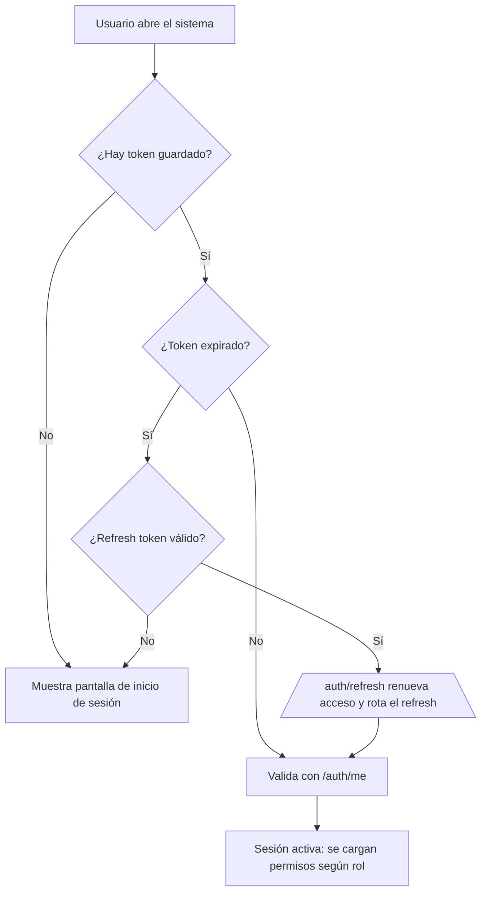

# Flujo: Inicio de sesión y sesión



```mermaid
sequenceDiagram
    participant U as Usuario
    participant S as SPA (frontend)
    participant B as API (FastAPI)
    participant D as BD

    U->>S: Escribe usuario y contraseña
    S->>B: POST /api/auth/login (usuario normalizado, bcrypt, rate-limit 5/min)
    B->>D: Verifica usuario activo y no bloqueado
    alt Password incorrecto
        B->>D: +1 intento fallido (bloqueo a los 5 por 15 min)
        B-->>S: 401 "Usuario o contraseña incorrectos"
    else Password correcto
        B->>D: Resetea intentos; genera JWT acceso + refresh token
        B-->>S: {access_token, refresh_token}
        S->>S: Guarda en localStorage (store_token, store_refresh_token)
        S-->>U: Sesión iniciada, UI según rol
    end

    Note over S,B: Cada petición lleva Authorization: Bearer access_token
    S->>B: GET /api/auth/me (o cualquier endpoint)
    B->>B: Valida JWT → usuario activo → permiso

    opt Token de acceso por vencer
        S->>B: POST /api/auth/refresh (única solicitud en paralelo)
        B->>D: Rota el refresh token (revoca el anterior, misma familia)
        B-->>S: Nuevo par de tokens → S reintenta la petición original
    end

    opt Usuario cierra sesión
        S->>B: POST /api/auth/logout
        B->>D: Revoca todos los refresh tokens del usuario
        S->>S: Borra tokens de localStorage → pantalla de login
    end
```

## Puntos clave

- El nombre de usuario se **normaliza a minúsculas**; un usuario **inactivo** ya
  no puede entrar (401 genérico, no se revela el motivo).
- **Bloqueo**: 5 intentos fallidos consecutivos ⇒ cuenta bloqueada 15 minutos
  (configurable con `LOCKOUT_MAX_ATTEMPTS` / `LOCKOUT_DURATION_MINUTES`).
- **Renovación silenciosa**: si el access token expiró, la aplicación lo
  renueva automáticamente con el refresh token y **reintenta** la petición que
  falló (una sola llamada a `/auth/refresh` para peticiones simultáneas).
- **Rotación con detección de robo**: si se reutiliza un refresh token ya
  revocado, se **revoca toda la familia** de sesiones de ese usuario.
- Al **cambiar contraseña**, se revocan todas las sesiones del usuario.
- El refresh token vive **7 días** por defecto (`REFRESH_TOKEN_EXPIRE_DAYS`);
  el access token **24 h** por defecto (`JWT_EXPIRE_MINUTES`).

Ver reglas completas: [Roles y permisos](../business/roles-permissions.md) y
[Seguridad](../technical/auth-security.md).