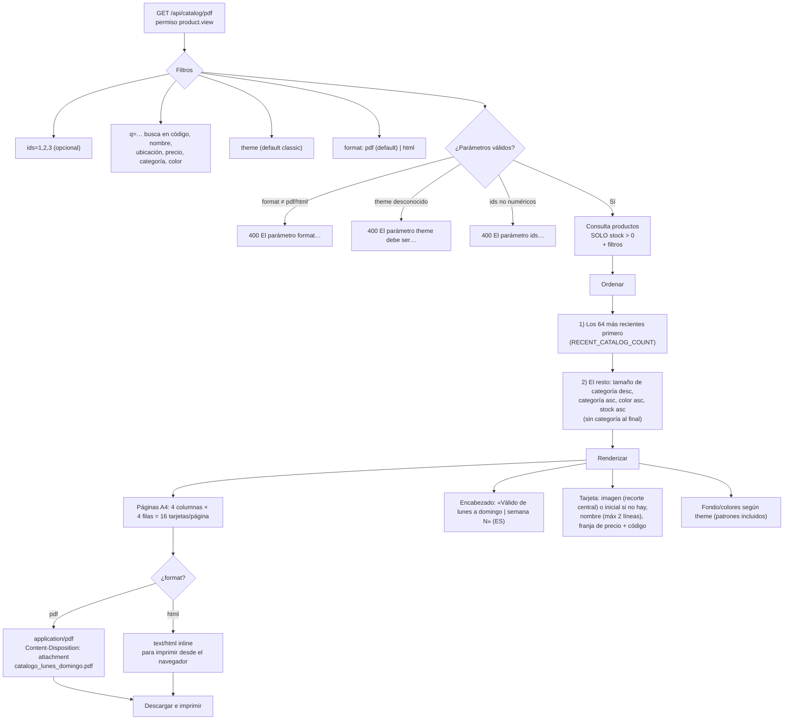

# Flujo: Catálogo PDF

## Notas del flujo

- La semana se calcula de **la fecha actual**: lunes de la semana vigente →
  domingo siguiente, número de semana ISO, meses en español.
- Productos con imagen inválida se **omiten con placeholder de inicial** (no
  rompen la generación).
- Misma lógica de búsqueda que el panel de productos (con caracteres `% _ \`
  escapados).
- El cabecero y el diseño replican [`docs/card-mockup.html`](../card-mockup.html).

Ver reglas detalladas: [Catálogo PDF](../business/catalog-pdf.md).