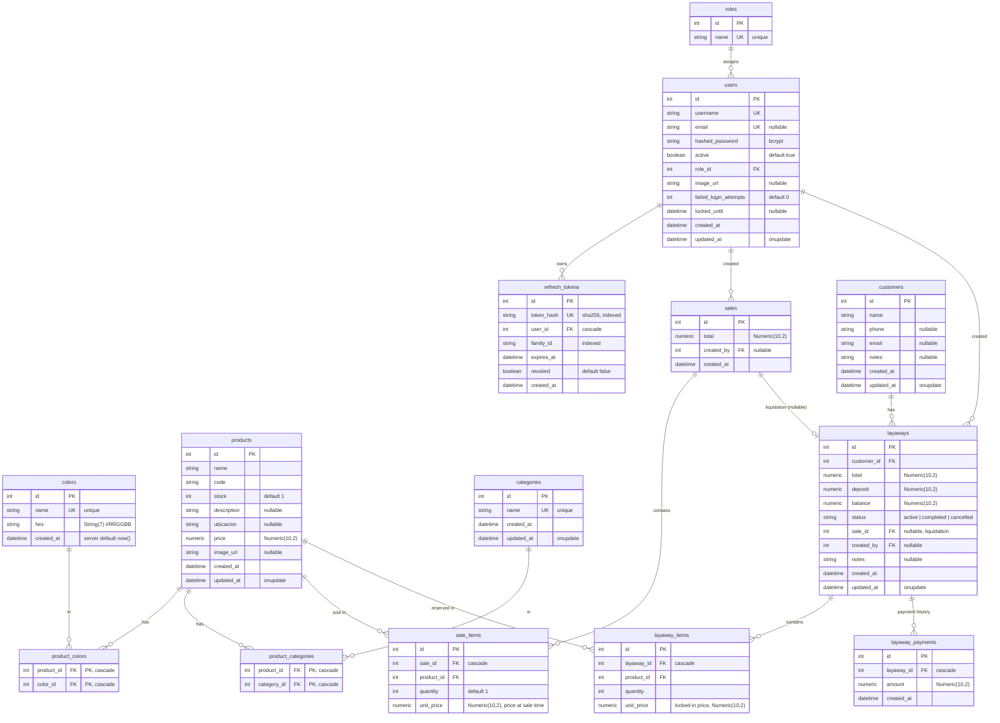

# Database

PostgreSQL, accessed through SQLAlchemy 2.0 ORM. The canonical schema is
[`backend/app/models.py`](../../backend/app/models.py) — 11 tables plus two many-to-many association tables.

## Schema conventions

- **Monetary and quantity fields** are `Numeric(10, 2)`; totals are computed
  server-side, never trusted from the client.
- **Timestamps**: `created_at = server_default=func.now()`;
  `updated_at` additionally has `onupdate=func.now()`. Both are `nullable` in
  the ORM so server defaults apply at insert.
- **Cascades**:
  - `product_colors` / `product_categories` rows cascade on product delete
    (also on color/category delete via the other FK).
  - `sale_items`, `layaway_items`, and `layaway_payments` delete with their
    parent row (`ondelete="CASCADE"` client-side).
  - `refresh_tokens` cascade when a user is deleted.
  - `users.created_by` / `layaways.created_by` / `sales.created_by` → `users`
    are soft (nullable, no cascade): deleting a user is expected to be
    blocked/absent rather than removing history.
  - `layaways.sale_id` is nullable and set only when a layaway is liquidated
    into a sale.

## Uniqueness rules

- `colors.name`, `categories.name`, `roles.name`, `users.username`
  (and `users.email` when present) are unique.
- `refresh_tokens.token_hash` is unique.

## Status domain

`layaways.status` takes one of `active`, `completed`, `cancelled`. There is no
CHECK constraint in the ORM; the router ([`app/routers/layaways.py`](../../backend/app/routers/layaways.py)) is the
enforcement point. `products.stock` is a plain integer; the business rule
"stock must never go negative" is enforced at write time in the sale/layaway
routers, not by a DB constraint.

## Schema management

- `docker-entrypoint.sh` runs `Base.metadata.create_all` to ensure tables, then
  `alembic upgrade head` when migration history exists, otherwise
  `alembic stamp head` (fresh DB bootstrapped from models).
- The dev `db` service is `postgres:16-alpine`; Cloud SQL runs PostgreSQL 16.

## Concurrency note

Single-process deployments (gunicorn, 2 workers) rely on the *savepoint-per-
transaction* pattern (see [`sales.py`](../../backend/app/routers/sales.py), [`layaways.py`](../../backend/app/routers/layaways.py)) for stock decrements; the
read-modify-write on `products.stock` is not `SELECT … FOR UPDATE` guarded
today — a known limitation if horizontal scaling is ever introduced.